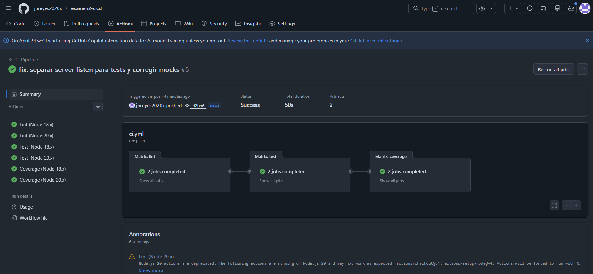
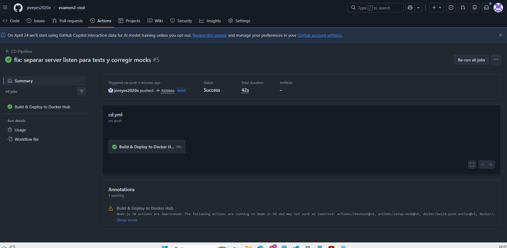

# 📦 To-Do API — Examen 2: CI/CD con GitHub Actions y Docker

API REST de gestión de tareas construida con Node.js, Express y PostgreSQL.

---

## 🚀 Cómo correr el proyecto

### Con Docker Compose (recomendado)
```bash
docker-compose up --build
```
La app queda disponible en: http://localhost:3000

### Endpoints disponibles
| Método | Ruta         | Descripción              |
|--------|--------------|--------------------------|
| GET    | /health      | Health check             |
| GET    | /tasks       | Listar todas las tareas  |
| POST   | /tasks       | Crear nueva tarea        |
| PATCH  | /tasks/:id   | Toggle completado        |
| DELETE | /tasks/:id   | Eliminar tarea           |

---

## 🐳 Actividad 1 — Errores corregidos en Dockerfile

| # | Error original | Corrección aplicada |
|---|---------------|---------------------|
| 1 | `FROM node:latest` | `FROM node:18-alpine` — versión específica y liviana |
| 2 | `COPY . .` antes del install | Separar: `COPY package*.json ./` → `RUN npm install` → `COPY . .` |
| 3 | `npm install` sin `RUN` | `RUN npm install --production` |
| 4 | `EXPOSE 80` | `EXPOSE 3000` — puerto real de la app |

---

## ⚙️ Actividad 2 — Pipeline CI

Archivo: `.github/workflows/ci.yml`

- **Triggers:** push a `main`, `pull_request`
- **Jobs:** `lint` → `test` → `coverage` (en cadena con `needs`)
- **Matrix:** Node.js `18.x` y `20.x`
- **Cache:** npm cache configurado en `actions/setup-node`

---

## 🚢 Actividad 3 — Pipeline CD

Archivo: `.github/workflows/cd.yml`

- **Trigger:** solo `push` a `main`
- **Environment:** `production`
- **Secrets usados:**
  - `DOCKER_USERNAME` — usuario de Docker Hub
  - `DOCKER_TOKEN` — access token de Docker Hub
- **Deploy:** build y push de imagen a Docker Hub

> 📸 Ver sección de evidencia al final de este README.

---

## 🔧 Actividad 4 — Troubleshooting

### Snippet 1 — Error de sintaxis en triggers
```yaml
# ❌ Antes
on:
  push
  branches: [main]

# ✅ Después
on:
  push:
    branches: [main]
  pull_request:
    branches: [main, develop]
```
**Error:** Faltaban `:` después de `push`, `pull_request` y `branches`.

### Snippet 2 — Referencia incorrecta a secrets
```yaml
# ❌ Antes
VERCEL_TOKEN: secrets.VERCEL_TOKEN

# ✅ Después
VERCEL_TOKEN: ${{ secrets.VERCEL_TOKEN }}
```
**Error:** Los secrets requieren la sintaxis de expresión `${{ }}`.

### Snippet 3 — Matrix y cache inválidos
```yaml
# ❌ Antes
node-version: 18
cache: npm

# ✅ Después
node-version: [18.x, 20.x]
cache: 'npm'
```
**Error:** La matrix necesita un array, no un escalar. `cache` debe ir entre comillas.

---

## 📚 Actividad 5 — Preguntas Conceptuales

### 5. ¿Cuál es la diferencia fundamental entre CI y CD?

**CI (Integración Continua)** es la práctica de integrar cambios de código frecuentemente al repositorio principal, ejecutando automáticamente builds y tests para detectar errores temprano. El objetivo es validar que el código nuevo no rompe lo existente.

**CD (Entrega Continua)** va un paso más allá: una vez que el código pasa el CI, se despliega automáticamente a un entorno (staging o producción). CI valida el código; CD lo entrega.

---

### 6. ¿Qué es un GitHub self-hosted runner y cuándo usarlo?

Un **self-hosted runner** es una máquina propia (servidor, VM o computadora local) que tú configuras para ejecutar los workflows de GitHub Actions en lugar de usar los runners en la nube de GitHub.

Se usaría cuando:
- Necesitas acceso a recursos internos de red (bases de datos privadas, servidores on-premise).
- El proyecto tiene requisitos de hardware especiales (GPU, mucha RAM).
- Quieres reducir costos en proyectos con pipelines muy largos.
- Tienes restricciones de seguridad o cumplimiento normativo que impiden usar runners externos.

---

### 7. ¿Cuál es el propósito de los GitHub Environments?

Los **GitHub Environments** permiten definir entornos de despliegue (como `staging`, `production`) con reglas de protección propias. Sus usos principales son:

- **Secrets específicos por entorno:** cada environment tiene sus propios secrets separados del repositorio.
- **Reglas de aprobación:** se pueden requerir aprobaciones manuales antes de desplegar a producción.
- **Historial de deployments:** GitHub registra qué commit se desplegó a cada entorno y cuándo.

En un workflow se usan así:
```yaml
jobs:
  deploy:
    environment: production   # Activa las protecciones y secrets de ese environment
```

---

### 8. ¿Qué es una rollback strategy y cómo se implementaría en CD?

Una **rollback strategy** es el plan para revertir un deployment fallido a la versión anterior estable, minimizando el tiempo de interrupción del servicio.

Implementación en un pipeline de CD:
1. **Taggear imágenes Docker** con el SHA del commit (`imagen:abc1234`) además de `latest`, para poder volver a cualquier versión anterior.
2. **Guardar el SHA del último deploy exitoso** como variable o artifact.
3. **Agregar un job de rollback** que se active si el deploy falla:
```yaml
- name: Rollback si falla
  if: failure()
  run: docker pull mi-usuario/todo-api:${{ env.LAST_STABLE_SHA }}
       docker tag ... && docker push ...
```
4. En plataformas como Vercel o Railway, usar el botón de "Redeploy previous deployment" desde la interfaz.

---

## 📸 Evidencia de Deployment

<!-- Agrega aquí un screenshot del Actions tab mostrando el CD pipeline exitoso -->
> ⬇️ Screenshot del deployment exitoso en GitHub Actions:




---

*Examen 2 — Sistemas Operativos I | CEUTEC San Pedro Sula*
